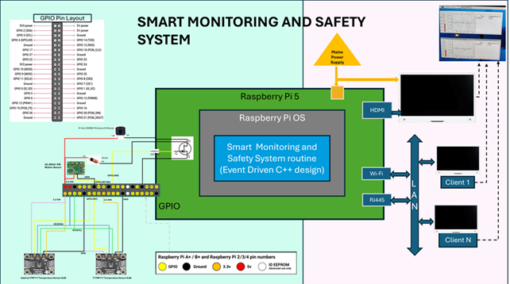

# Smart-Monitoring-and-Safety-System
University of Glasgow ENG5220: Real Time Embedded Programming (2024-25) Group Project
# Project Overview  

A real-time monitoring solution for **critical and non-critical environments** using **Raspberry Pi 5**.  
This system ensures **safety, surveillance, and real-time alerts** by monitoring temperature levels, motion detection and triggering alerts via active buzzer beep. 
 **Developed using:** C++, Raspberry Pi, GPIO, Fast DDS and QT.

---

## Features
 - **Real-time temperature monitoring** using Texas Instruments TMP117 Temperature sensors
 - **Real-time motion detection** using PIR motion sensor  
 - **Multi-threaded event handling** for optimized utilisation of system resources in real-time system  
 - **Threshold alerts with buzzer** for the consumer environment
 - **Intuitive screen display** for easy monitoring and useful to visualize different aspects of the environment easily
 - **Publish updates to subscribers** to support remote and multi-user environment 
 - **Live camera surveillance for monitoring remote environments** to be implemented in next phase 
 - **Scalable design for critical (like  Substations, NHS) & non-critical (e.g., homes, farms) use cases**  

---

## System Architecture

### **Hardware Components**
- **Raspberry Pi 5** – Central processing unit
- **Temperature Sensors** – Reads environmental temperature
- **PIR motion sensor** - Reads movements
- **Buzzer** – Alerts when temperature exceeds threshold ans and when motion detect
- **Camera Module** – Provides live surveillance
- **LAN Interface** – Transmits real-time alerts to connected client applications using real-time FAST DDS Publisher Subscriber model

### **Software Components**
- **C++ Daemon**: Periodically reads sensors data and handles event-driven actions
- **Multithreading System**: Manages parallel events in real-time
- **QT GUI**: Displays temperature information in conventional thermo view, visualize the pattern in graph view, and easy to read Time and Temperature view
- **Subscribers**: Receives temperature event notifications from main process to display the information for remote Consumers.

### **Design Scematic**


## How It Works
1. **Sensors collect temperature data every second** via GPIO.
2. The **C++ daemon processes the data**, and activates event handlers.
3. Event handlers perform multiple tasks:
   - **Display temperature information on the screen**
   - **Trigger a buzzer alarm when threshold exceeds**
   - **Publish notifications to Subscribers**
   - **Start live video surveillance (if enabled)**
4. **Users can remotely monitor sensor readings and alerts via LAN-connected apps.**
5. The system operates autonomously with **minimal latency** using a **multi-threaded architecture**.

##  Prerequisites
Before building or running this project, make sure the following dependencies are installed on your system:


### GPIO
```bash
sudo apt-get update
sudo apt-get install libgpiod-dev
```
---
### QT
```bash
sudo apt-get install qtdeclarative5-dev-tools qt5-qmake qt5-qmake-bin qtbase5-dev qtbase5-dev-tools
sudo apt-get install libqwt-qt5-dev
```
---
### Fast DDS Components
#### Fast CDR
```bash
sudo apt install libfastcdr-dev
```
#### Fast RTPS
```bash
apt install libfastrtps-dev
```
#### Fast DDS tools
```bash
apt install fastddsgen fastdds-tools
```
---
## Project Management  
Track our progress on the [GitHub Project Board](https://github.com/users/grp2002/projects/3).

## 📷✨ Follow us
on [Instagram](https://www.instagram.com/smartmonitor_uofg?igsh=MXhla2t0dzdzMWViOA%3D%3D&utm_source=qr)

## Our Contributors Great job team!

| Name         			| GitHub Profile                     |
|-------------------------------|------------------------------------|
| Pragya Shilakari  | [@pshilakari](https://github.com/pshilakari) |
| Gregory Paphiti   | [@grp2002](https://github.com/grp2002)   |
| Abhishek Jain     | [@abjain182002](https://github.com/abjain182002) |
| Ninad Shende      | [@Ninadshende2508](https://github.com/Ninadshende2508) |
| Ugochukwu Elvis Som Anene  | [@Ugosoft13](https://github.com/Ugosoft13) |
| Hankun Ma         | [@Hankun-P](https://github.com/Hankun-P) |

---
## Repository Structure

- **./src folder** for the source code of the software
- **./docs/design folder** for design documents
- **./docs/Test Cases folder** for test cases and test evidences
- **./docs/images folder** for design drawings
- **./docs folder** for all project related documents 
- **home** for Readme and LICENSE
---
## 📚 Third-Party Libraries

This project uses the following third-party libraries:

### 📸 [libcamera2opencv](https://github.com/berndporr/libcamera2opencv)

- Author: [Bernd Porr](https://github.com/berndporr)
- License: [BSD 2-Clause](https://opensource.org/licenses/BSD-2-Clause)

This library is used for interfacing libcamera with OpenCV for real-time frame processing.

